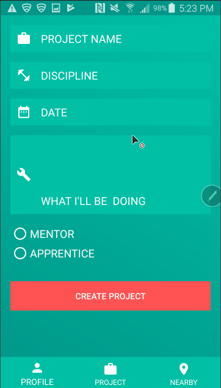

# BushidoApp
Bushido is a pretty ambitious application. Essentially, Im trying to create a platform where users can find,work with, and colloborate with mentors and mentees. Back yonder, in order to learn hard skills you had to work under the watchful eye of a master craftsman to learn a skill. You gave your time, and your effort, the mentor gave his knowledge, patience and expertise.

Eventually BushidoApp will do the same thing, give individuals who are seeking mentorship the oppurtunity to learn hard skills from masters of a given trade through requesting an oppurtunity to work on an ongoing project or start a new one .

## Would you look at that? My first LIVE Android Application

## Oh look Chat!

## Create your own projects and post them so mentors or mentees can collaborate!

### BushidoApp Utilization
* Object Oriented concepts
* Google Authentications
*G
*Firebase for data persistence*
*Firebase for chat persistence*
*Firebases native RecyclerView Adapter*

